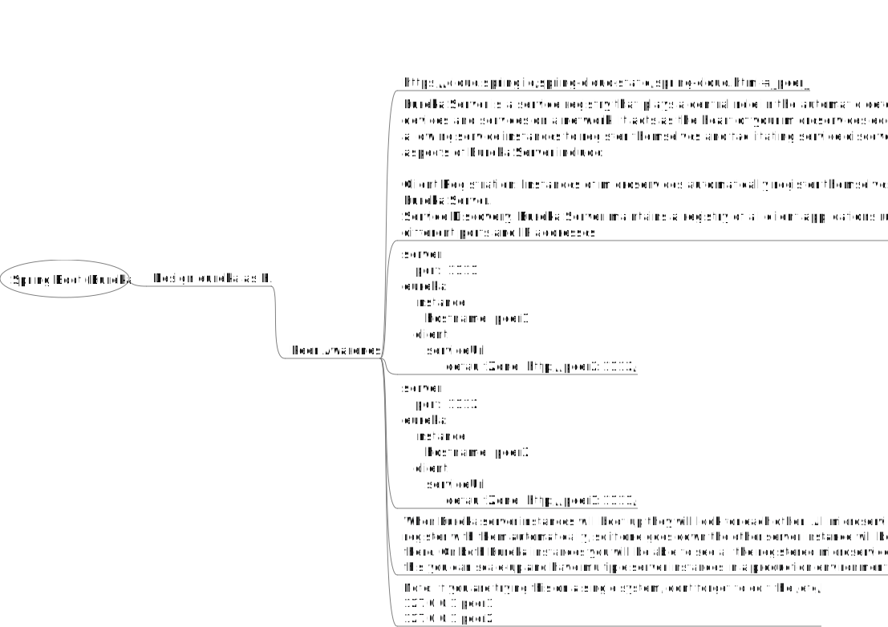

### Spring Boot Eureka is a service registry for microservices, enabling service discovery and load balancing. It helps services locate and communicate with each other dynamically.
How do we able to design HA (High Availability) in Eureka? 
Answer is ```Peer Awareness!!```


